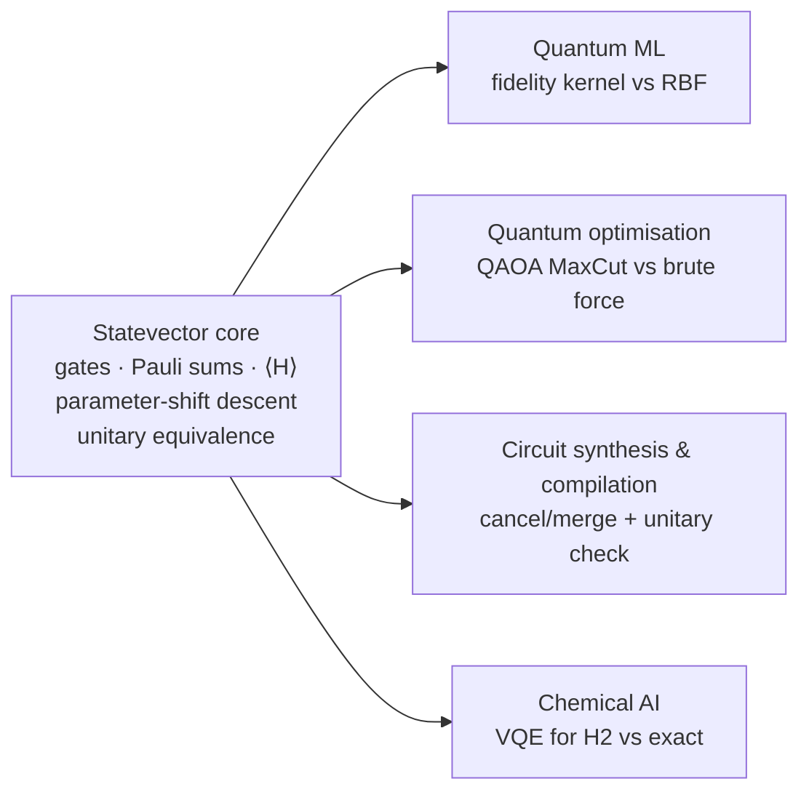

# AI ∩ Quantum Computing: one core, four applications

`src/mqoes/intersection.py` is a single standard-library module. It takes the four items in the
centre of the "AI ∩ Quantum Computing" Venn diagram and builds each one as a short application
of **the same** small, exact statevector core.

```
python3 run.py intersection          # prints a summary, writes reports/intersection.json
python3 src/mqoes/intersection.py    # standalone summary (no project needed)
```

> **Honesty.** These are exact *classical* simulations of toy problems, done with Python
> floats. They are not QPU runs and not evidence of quantum advantage. They are not connected
> to the OES detector: no detector module imports this file, and this file imports nothing
> from the detector path.



## The core (about 200 lines including docstrings)
| piece | what it is |
|---|---|
| `Gate`, `Param`, `Circuit` | frozen dataclasses. Rotations are exp(−iθ/2·P); a `Param` refers to a parameter-vector entry (with a scale) |
| `apply`, `run` | exact n-qubit statevector update for H, X, Z, RX, RY, RZ, CNOT, CZ, RZZ |
| `apply_pauli`, `expectation` | Pauli-string action and ⟨ψ|H|ψ⟩ for a Pauli sum (I/Z-only strings take a diagonal fast path) |
| `parameter_shift_gradient`, `minimize` | exact ±π/2 shift-rule gradients and deterministic gradient descent |
| `unitary_columns`, `equivalent` | full-unitary comparison up to one global phase |
| `observable_matrix`, `exact_ground_energy` | dense matrix and Jacobi diagonalisation, used as the exact reference |

## The four applications
| diagram item | in this module | result (from `reports/intersection.json`) |
|---|---|---|
| Quantum Machine Learning | 2-qubit ZZ-style feature map → fidelity kernel → kernel nearest-centroid on 64 invented points (32/32 split), against the same classifier with a classical RBF kernel (γ = 1, fixed in advance) | quantum kernel **0.53125**, RBF **0.90625** test accuracy |
| Quantum Optimisation | QAOA p = 1 and 2 for MaxCut on a 5-node ring plus a chord, against brute force over all 32 cuts | max cut 5; p=1 ratio **0.8220137769**; p=2 ratio **0.9246859523** (random assignment: 3.0/5 = 0.6) |
| Quantum Circuit Synthesis & Compilation | one pass that cancels adjacent self-inverse gates and merges adjacent same-axis rotations, checked by full-unitary equivalence; a deliberately faulty compile must fail that check | **15 → 3** gates; equivalent: true; faulty compile detected: true |
| Chemical AI | VQE with a one-parameter ansatz cos(θ/2)\|01⟩ + sin(θ/2)\|10⟩ on the 2-qubit H2 Hamiltonian at 0.735 Å, against exact diagonalisation of the same 4×4 matrix | VQE **−1.8572750302** Ha, exact **−1.8572750302** Ha, error 4.4e-16 |

**Reading the results honestly:**
- On this data the quantum kernel scored at chance. Its average off-diagonal value is about 0.25
  (roughly 1/dimension, what random 2-qubit states would give), so this feature map at this input
  scale spreads points almost randomly and carries little class structure. A classical RBF kernel
  with an untuned γ did much better.
- QAOA's ratios are typical of shallow QAOA on a tiny graph. Brute force is trivial at this size.
- VQE is exact here because the ground state lies in the two-state {|01⟩, |10⟩} sector the
  ansatz covers. The interesting check is that the core's gradients find it, and that the
  reference-state energy (θ = 0: −1.8369679912 Ha) lies above it.

## H2 Hamiltonian source
The coefficients are copied verbatim from the Qiskit tutorials, which describe the operator as
"originally computed by Qiskit Nature for an H2 molecule" at 0.735 Å:

```
II −1.052373245772859   IZ  0.39793742484318045   ZI −0.39793742484318045
ZZ −0.01128010425623538 XX  0.18093119978423156
```

- Qiskit Algorithms, *Advanced VQE Options*:
  https://qiskit-community.github.io/qiskit-algorithms/tutorials/02_vqe_advanced_options.html
  It gives the reference value −1.85728, which the module reproduces (−1.8572750302).
- The same operator appears in qiskit-tutorials `tutorials/algorithms/01_algorithms_introduction.ipynb`.

Units are hartree, as given by the source. The source does not say whether nuclear repulsion is
included, so the module adds nothing to it. O'Malley et al. (2016) were **not** used as a source.

## Limits
- Toy sizes (2–5 qubits), dense statevectors, Python floats; noise, shots and hardware are not
  modelled.
- The optimiser is plain gradient descent from deterministic starts. For QAOA it finds a
  stationary point (all |gradient| < 1e-9) that is not guaranteed to be global.
- The compiler pass uses only wire-adjacency (no commutation rules) and handles a small gate set.
- The QML comparison uses one dataset, one split, and fixed hyperparameters. It is not a benchmark.
